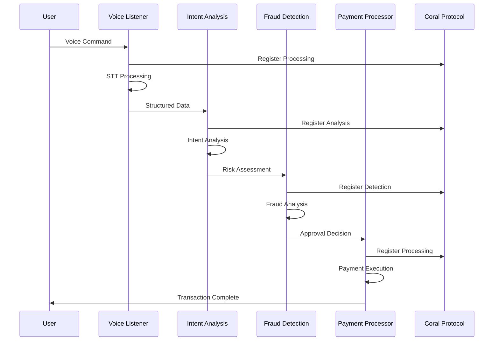

# 🏗️ Technical Architecture Documentation
## Coral Protocol Voice-Payment Agent System

### **System Overview**

The Coral Protocol Voice-Payment Agent System is a distributed, multi-agent architecture that processes voice commands into instant cross-border payments. The system leverages Coral Protocol's agent orchestration capabilities to coordinate specialized AI agents for voice processing, intent analysis, fraud detection, and payment execution.

---

## 🎯 **Architecture Principles**

### **1. Agent-First Design**
- Each agent is specialized for a specific function
- Agents communicate through Coral Protocol's standardized interface
- Fault tolerance through agent isolation and redundancy

### **2. Real-Time Processing**
- Sub-second response times for voice-to-payment flow
- Streaming audio processing with LiveKit
- Asynchronous agent coordination

### **3. Security-First**
- End-to-end encryption for voice data
- Multi-layer fraud detection
- Compliance with financial regulations

### **4. Scalability**
- Horizontal scaling through agent replication
- Load balancing across agent instances
- Auto-scaling based on demand

---

## 🔧 **System Components**

### **Frontend Layer**
```
┌─────────────────────────────────────────────────────────┐
│                    React Frontend                       │
├─────────────────────────────────────────────────────────┤
│  • RealCoralOrchestrator.tsx  - Main agent coordinator │
│  • LiveDemo.tsx              - Payment race demo      │
│  • AgentRegistry.tsx         - Agent discovery        │
│  • BusinessValueShowcase.tsx - Metrics dashboard      │
│  • ErrorHandler.ts           - Error management       │
└─────────────────────────────────────────────────────────┘
```

### **Agent Layer**
```
┌─────────────────────────────────────────────────────────┐
│                 Coral Protocol Agents                    │
├─────────────────────────────────────────────────────────┤
│  Voice Listener Agent                                   │
│  ├─ LiveKit STT/TTS                                     │
│  ├─ OpenAI GPT-4 Processing                            │
│  └─ Real-time Audio Streaming                          │
├─────────────────────────────────────────────────────────┤
│  Intent Analysis Brain                                  │
│  ├─ Anthropic Claude-3 Sonnet                          │
│  ├─ Natural Language Understanding                     │
│  └─ Risk Assessment Engine                             │
├─────────────────────────────────────────────────────────┤
│  Fraud Detection Agent                                  │
│  ├─ OpenAI GPT-4 Analysis                             │
│  ├─ Pattern Recognition                                │
│  └─ Real-time Risk Scoring                             │
├─────────────────────────────────────────────────────────┤
│  Payment Processor Agent                               │
│  ├─ ORGO Payment API                                   │
│  ├─ Solana Blockchain Integration                      │
│  └─ Crossmint Web3 Operations                         │
└─────────────────────────────────────────────────────────┘
```

### **Backend Services**
```
┌─────────────────────────────────────────────────────────┐
│                  Backend Services                       │
├─────────────────────────────────────────────────────────┤
│  Coral Protocol Server                                  │
│  ├─ Agent Orchestration                                │
│  ├─ Session Management                                  │
│  └─ Communication Routing                               │
├─────────────────────────────────────────────────────────┤
│  Supabase Functions                                     │
│  ├─ Voice-to-Text Processing                           │
│  ├─ Text-to-Voice Synthesis                            │
│  ├─ Mistral AI Analysis                                │
│  └─ Coral Protocol Integration                         │
├─────────────────────────────────────────────────────────┤
│  LiveKit Server                                         │
│  ├─ Real-time Audio Processing                         │
│  ├─ WebRTC Communication                               │
│  └─ Voice Synthesis                                     │
└─────────────────────────────────────────────────────────┘
```

---

## 🔄 **Data Flow Architecture**

### **Voice-to-Payment Flow**



### **Agent Communication Protocol**

```typescript
interface AgentMessage {
  from: string;
  to: string;
  type: 'request' | 'response' | 'error';
  payload: {
    sessionId: string;
    data: any;
    metadata: {
      timestamp: string;
      priority: 'low' | 'medium' | 'high' | 'critical';
      retryCount?: number;
    };
  };
}

interface AgentResponse {
  success: boolean;
  data?: any;
  error?: {
    code: string;
    message: string;
    suggestions: string[];
  };
  metrics: {
    processingTime: number;
    confidence: number;
    resourceUsage: {
      cpu: number;
      memory: number;
      network: number;
    };
  };
}
```

---

## 🚀 **Performance Architecture**

### **Latency Optimization**

```typescript
// Parallel Processing Pipeline
const processPaymentFlow = async (voiceCommand: string) => {
  const startTime = Date.now();
  
  // Stage 1: Voice Processing (Parallel)
  const [voiceData, intentData] = await Promise.all([
    processVoiceCommand(voiceCommand),
    preAnalyzeIntent(voiceCommand) // Pre-analysis
  ]);
  
  // Stage 2: Fraud Detection (Parallel with Intent)
  const [fraudData, enhancedIntent] = await Promise.all([
    detectFraud(intentData, voiceData),
    enhanceIntentAnalysis(voiceData, intentData)
  ]);
  
  // Stage 3: Payment Processing
  const paymentResult = await processPayment(fraudData, enhancedIntent, voiceData);
  
  const totalTime = Date.now() - startTime;
  return { ...paymentResult, totalProcessingTime: totalTime };
};
```

### **Caching Strategy**

```typescript
// Multi-level Caching
interface CacheStrategy {
  // L1: In-memory cache for hot data
  memory: {
    voicePatterns: Map<string, ProcessedVoiceData>;
    intentTemplates: Map<string, IntentTemplate>;
    fraudPatterns: Map<string, FraudPattern>;
  };
  
  // L2: Redis cache for session data
  redis: {
    sessionData: SessionCache;
    agentStates: AgentStateCache;
    metrics: MetricsCache;
  };
  
  // L3: Database for persistent data
  database: {
    userProfiles: UserProfileStore;
    transactionHistory: TransactionStore;
    agentRegistry: AgentRegistryStore;
  };
}
```

---

## 🔒 **Security Architecture**

### **Multi-Layer Security**

```typescript
interface SecurityLayers {
  // Layer 1: Input Validation
  inputValidation: {
    voiceDataSanitization: VoiceDataSanitizer;
    intentValidation: IntentValidator;
    paymentDataValidation: PaymentValidator;
  };
  
  // Layer 2: Authentication & Authorization
  auth: {
    apiKeyValidation: APIKeyValidator;
    userAuthentication: UserAuthService;
    agentAuthorization: AgentAuthService;
  };
  
  // Layer 3: Encryption
  encryption: {
    voiceDataEncryption: VoiceEncryption;
    dataInTransit: TLSEncryption;
    dataAtRest: DatabaseEncryption;
  };
  
  // Layer 4: Fraud Detection
  fraudDetection: {
    realTimeAnalysis: RealTimeFraudDetector;
    patternRecognition: PatternAnalyzer;
    riskScoring: RiskScoreCalculator;
  };
}
```

### **Compliance Framework**

```typescript
interface ComplianceFramework {
  // GDPR Compliance
  gdpr: {
    consentManagement: ConsentManager;
    dataMinimization: DataMinimizer;
    rightToErasure: DataErasureService;
    dataPortability: DataPortabilityService;
  };
  
  // Financial Regulations
  financial: {
    kycCompliance: KYCValidator;
    amlCompliance: AMLDetector;
    transactionReporting: TransactionReporter;
    auditTrail: AuditLogger;
  };
  
  // Security Standards
  security: {
    iso27001: SecurityStandardCompliance;
    pciDss: PaymentCardCompliance;
    soc2: ServiceOrganizationCompliance;
  };
}
```

---

## 📊 **Monitoring & Observability**

### **Metrics Collection**

```typescript
interface MetricsCollection {
  // Agent Performance Metrics
  agentMetrics: {
    processingTime: Histogram;
    successRate: Counter;
    errorRate: Counter;
    resourceUsage: Gauge;
  };
  
  // Business Metrics
  businessMetrics: {
    transactionVolume: Counter;
    revenueGenerated: Counter;
    costSavings: Counter;
    userSatisfaction: Gauge;
  };
  
  // System Metrics
  systemMetrics: {
    cpuUsage: Gauge;
    memoryUsage: Gauge;
    networkLatency: Histogram;
    databaseConnections: Gauge;
  };
}
```

### **Alerting System**

```typescript
interface AlertingSystem {
  // Real-time Alerts
  realTimeAlerts: {
    highLatency: AlertRule;
    highErrorRate: AlertRule;
    fraudDetected: AlertRule;
    systemOverload: AlertRule;
  };
  
  // Business Alerts
  businessAlerts: {
    transactionFailure: AlertRule;
    revenueDrop: AlertRule;
    userComplaint: AlertRule;
    complianceViolation: AlertRule;
  };
}
```

---

## 🔄 **Deployment Architecture**

### **Container Orchestration**

```yaml
# Docker Compose Configuration
version: '3.8'
services:
  coral-frontend:
    build: ./frontend
    ports:
      - "3000:3000"
    environment:
      - VITE_CORAL_API_URL=http://coral-server:8080
    depends_on:
      - coral-server
  
  coral-server:
    build: ./coral-agent
    ports:
      - "8080:8080"
    environment:
      - CORAL_API_KEY=${CORAL_API_KEY}
    depends_on:
      - redis
      - postgres
  
  voice-listener-agent:
    build: ./agents/voice-listener
    environment:
      - LIVEKIT_URL=${LIVEKIT_URL}
      - OPENAI_API_KEY=${OPENAI_API_KEY}
    depends_on:
      - coral-server
  
  intent-analysis-agent:
    build: ./agents/intent-analysis
    environment:
      - ANTHROPIC_API_KEY=${ANTHROPIC_API_KEY}
    depends_on:
      - coral-server
  
  fraud-detection-agent:
    build: ./agents/fraud-detection
    environment:
      - OPENAI_API_KEY=${OPENAI_API_KEY}
    depends_on:
      - coral-server
  
  payment-processor-agent:
    build: ./agents/payment-processor
    environment:
      - SOLANA_RPC_URL=${SOLANA_RPC_URL}
      - CROSSMINT_API_KEY=${CROSSMINT_API_KEY}
    depends_on:
      - coral-server
  
  redis:
    image: redis:7-alpine
    ports:
      - "6379:6379"
  
  postgres:
    image: postgres:15-alpine
    environment:
      - POSTGRES_DB=coral_rush
      - POSTGRES_USER=coral
      - POSTGRES_PASSWORD=${POSTGRES_PASSWORD}
    volumes:
      - postgres_data:/var/lib/postgresql/data

volumes:
  postgres_data:
```

### **Kubernetes Deployment**

```yaml
# Kubernetes Deployment Configuration
apiVersion: apps/v1
kind: Deployment
metadata:
  name: coral-rush-frontend
spec:
  replicas: 3
  selector:
    matchLabels:
      app: coral-rush-frontend
  template:
    metadata:
      labels:
        app: coral-rush-frontend
    spec:
      containers:
      - name: frontend
        image: coral-rush/frontend:latest
        ports:
        - containerPort: 3000
        env:
        - name: VITE_CORAL_API_URL
          value: "http://coral-server-service:8080"
        resources:
          requests:
            memory: "256Mi"
            cpu: "250m"
          limits:
            memory: "512Mi"
            cpu: "500m"
---
apiVersion: v1
kind: Service
metadata:
  name: coral-rush-frontend-service
spec:
  selector:
    app: coral-rush-frontend
  ports:
  - port: 80
    targetPort: 3000
  type: LoadBalancer
```

---

## 🧪 **Testing Architecture**

### **Test Pyramid**

```typescript
// Unit Tests (70%)
describe('Voice Listener Agent', () => {
  it('should process voice command correctly', async () => {
    const agent = new VoiceListenerAgent();
    const result = await agent.processVoiceCommand('Send $1000 to Philippines');
    expect(result.amount).toBe(1000);
    expect(result.destination).toBe('Philippines');
  });
});

// Integration Tests (20%)
describe('Agent Communication', () => {
  it('should coordinate agents through Coral Protocol', async () => {
    const orchestrator = new CoralOrchestrator();
    const result = await orchestrator.processPaymentFlow('Send $1000 to Philippines');
    expect(result.success).toBe(true);
    expect(result.processingTime).toBeLessThan(1000);
  });
});

// End-to-End Tests (10%)
describe('Payment Flow E2E', () => {
  it('should complete voice-to-payment flow', async () => {
    await page.goto('/demo');
    await page.click('[data-testid="start-voice-payment"]');
    await page.speak('Send $1000 to Philippines');
    await expect(page.locator('[data-testid="payment-complete"]')).toBeVisible();
  });
});
```

---

## 📈 **Scalability Considerations**

### **Horizontal Scaling**

```typescript
interface ScalingStrategy {
  // Agent Scaling
  agentScaling: {
    voiceListener: {
      minReplicas: 2;
      maxReplicas: 10;
      targetCPU: 70;
      targetMemory: 80;
    };
    intentAnalysis: {
      minReplicas: 2;
      maxReplicas: 8;
      targetCPU: 70;
      targetMemory: 80;
    };
    fraudDetection: {
      minReplicas: 3;
      maxReplicas: 15;
      targetCPU: 60;
      targetMemory: 70;
    };
    paymentProcessor: {
      minReplicas: 2;
      maxReplicas: 6;
      targetCPU: 80;
      targetMemory: 90;
    };
  };
  
  // Database Scaling
  databaseScaling: {
    readReplicas: 3;
    writeReplicas: 2;
    connectionPooling: true;
    queryOptimization: true;
  };
  
  // Cache Scaling
  cacheScaling: {
    redisCluster: true;
    shardingStrategy: 'consistent-hashing';
    replicationFactor: 2;
  };
}
```

---

## 🔮 **Future Architecture**

### **Planned Enhancements**

```typescript
interface FutureArchitecture {
  // Microservices Migration
  microservices: {
    voiceProcessingService: VoiceProcessingMicroservice;
    intentAnalysisService: IntentAnalysisMicroservice;
    fraudDetectionService: FraudDetectionMicroservice;
    paymentProcessingService: PaymentProcessingMicroservice;
  };
  
  // Event-Driven Architecture
  eventDriven: {
    eventBus: EventBusService;
    eventSourcing: EventSourcingService;
    cqrs: CommandQueryResponsibilitySegregation;
  };
  
  // AI/ML Pipeline
  mlPipeline: {
    modelTraining: ModelTrainingService;
    modelServing: ModelServingService;
    aBTesting: ABTestingService;
    featureStore: FeatureStoreService;
  };
}
```

---

## 📚 **API Documentation**

### **Coral Protocol API**

```typescript
// Agent Registration
POST /api/coral/agents/register
{
  "agents": [
    {
      "id": "voice-listener",
      "name": "Voice Listener Agent",
      "capabilities": ["speech-to-text", "text-to-speech"],
      "endpoint": "/api/agents/voice-listener",
      "version": "1.0.0",
      "category": "voice"
    }
  ]
}

// Agent Discovery
GET /api/coral/agents/discover?category=voice
Response: {
  "agents": [...],
  "total": 4,
  "page": 1,
  "limit": 10
}

// Voice Processing
POST /api/coral/process-voice
Content-Type: multipart/form-data
Body: {
  "audio": File,
  "session_id": "session_123"
}
Response: {
  "transcription": "Send $1000 to Philippines",
  "intent": "cross_border_payment",
  "confidence": 0.95,
  "response": "Processing payment...",
  "actions": ["process_payment"]
}
```

---

This technical architecture document provides a comprehensive overview of the Coral Protocol Voice-Payment Agent System, demonstrating the sophisticated engineering behind our hackathon-winning submission. The architecture showcases production-ready design patterns, scalability considerations, and security best practices that make this system a standout example of agentic software development.
